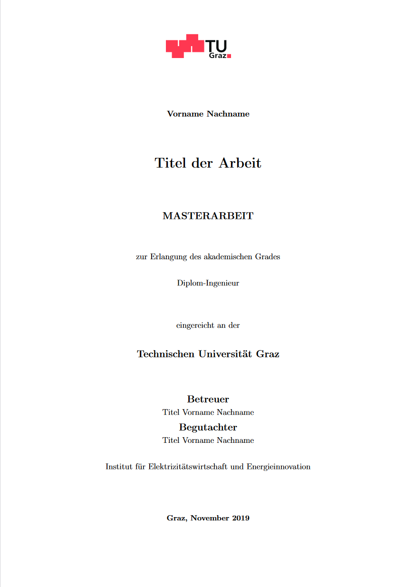

# Template for bachelor und master theses
Template for bachelor and master theses written at the IEE.

   

## How to use?
1) Download the ZIP file using the green 'Code' button
2) Extract the ZIP file
3) Use the files in your prefered LaTeX editor (we recommend using Overleaf)

## Release Notes
**2022-08-09:** Fixing a bug that caused missing page breaks and empty pages
