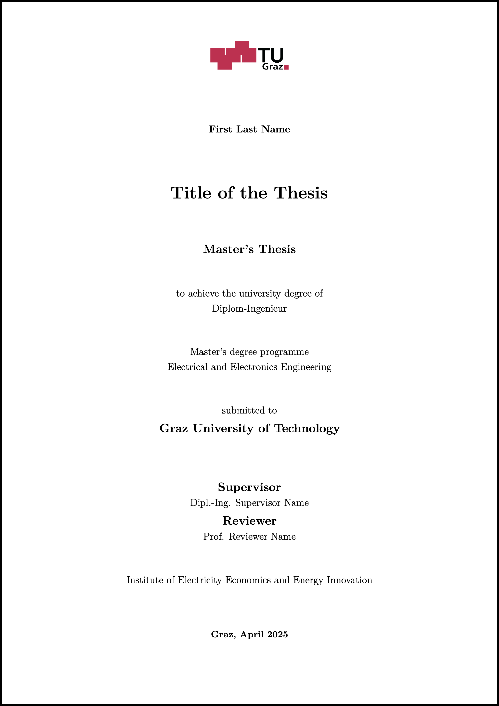

# Template for Bachelor’s and Master’s Theses
This document is the official LaTeX template of the Institute of Electricity Economics and Energy Innovation (IEE) for Bachelor’s and Master’s theses. It is designed to help students structure and format their work according to the institute’s academic and formatting standards.

   
  <b>Figure 1.</b> Title page of the template.

## How to use?
1) Download the ZIP file using the green 'Code' button
2) Extract the ZIP file
3) Use the files in your preferred LaTeX editor (we recommend using Overleaf)
4) Read the content of the template carefully. It explains the rules for writing a bachelor's or master's thesis at the IEE and provides helpful tips and tricks.

## Release Notes
- **2025-04-05:** Translate content to English. Add automatic switching between Bachelor's and Master's theses, as well as between German and English for the title page and other automatic headers and settings.
- **2025-04-03:** Remove affidavit as it is not allowed anymore because of data protection.
- **2025-03-28:** Update the title page to include the name of the degree program. Include new subsection Revision nach Korrektur.
- **2022-08-09:** Fixed a bug that caused missing page breaks and empty pages
